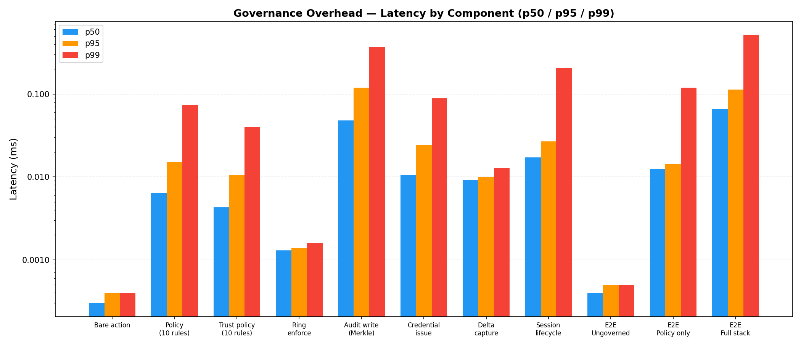
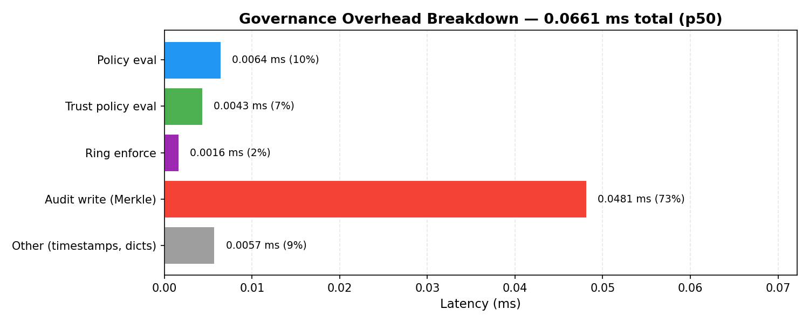

# Governance Overhead Benchmark

> **Issue:** [#720](https://github.com/microsoft/agent-governance-toolkit/issues/720)
> **Date:** 2026-04-04
> **Platform:** Windows 11, Intel Core i7-13th Gen, Python 3.12.8

## Summary

This benchmark measures the latency overhead that AGT governance layers add
to agent actions. It exercises the real implementations from all three packages:

| Package | Component tested |
|---------|-----------------|
| `agent-os` | `PolicyEvaluator` — declarative YAML/JSON rule engine |
| `agent-mesh` | `TrustPolicyEvaluator` — trust-score-based policy DSL |
| `agent-mesh` | `AuditLog` / `MerkleAuditChain` — append-only Merkle audit |
| `agent-mesh` | `CredentialManager` — ephemeral credential issuance & validation |
| `agent-hypervisor` | `RingEnforcer` — execution ring computation & checks |
| `agent-hypervisor` | `DeltaEngine` — VFS delta capture with hash chains |
| `agent-hypervisor` | `Hypervisor` — session create/join/activate/terminate |

### Key finding

Full-stack governance (policy + trust + ring check + Merkle audit) adds
**~0.07 ms at p50** and **~0.42 ms at p99** per agent action. For
context, a single LLM API call typically takes 200-2000 ms, making
governance overhead **< 0.04% of end-to-end latency** in practice.

## Charts





## End-to-End Comparison

```
                               p50 (ms)    p99 (ms)    ops/sec
Ungoverned action              0.0005      0.0007      2,000,000
Governed (policy only)         0.0086      0.0321        103,315
Governed (full stack)          0.0690      0.4160         11,227

Governance overhead (p50):     0.069 ms
Governance overhead (p99):     0.416 ms
```

The full governance stack is dominated by Merkle audit logging (~0.05 ms)
and trust policy evaluation (~0.004 ms). Ring enforcement is sub-microsecond.

## Detailed Results

### Baseline (No Governance)

| Operation | p50 (ms) | p95 (ms) | p99 (ms) | ops/sec |
|-----------|----------|----------|----------|---------|
| Bare action (dict construction) | 0.0005 | 0.0007 | 0.0009 | 865,501 |
| Simulated tool call + validation | 0.0021 | 0.0023 | 0.0024 | 463,542 |

### Policy Evaluation (agent-os)

| Rules | p50 (ms) | p95 (ms) | p99 (ms) | ops/sec |
|-------|----------|----------|----------|---------|
| 1 | 0.0054 | 0.0059 | 0.0062 | 185,065 |
| 10 | 0.0061 | 0.0066 | 0.0092 | 102,017 |
| 50 | 0.0119 | 0.0147 | 0.0642 | 60,544 |
| 100 | 0.0193 | 0.0233 | 0.0629 | 31,185 |

Policy evaluation scales linearly with rule count. Even with 100 rules,
p50 stays under 0.02 ms.

### Trust Policy Evaluation (agent-mesh)

| Rules | p50 (ms) | p95 (ms) | p99 (ms) | ops/sec |
|-------|----------|----------|----------|---------|
| 1 | 0.0030 | 0.0033 | 0.0037 | 279,666 |
| 10 | 0.0044 | 0.0052 | 0.0479 | 141,493 |
| 50 | 0.0101 | 0.0121 | 0.0431 | 23,646 |

Trust evaluation is slightly faster than agent-os policy evaluation at
equivalent rule counts due to simpler condition logic.

### Credential Operations (agent-mesh)

| Operation | p50 (ms) | p95 (ms) | p99 (ms) | ops/sec |
|-----------|----------|----------|----------|---------|
| Credential issuance | 0.0101 | 0.0144 | 0.0896 | 65,876 |
| Token validation (manager lookup) | 0.0450 | 0.0564 | 0.2190 | 17,027 |
| Token hash verify (SHA-256) | 0.0008 | 0.0009 | 0.0009 | 1,241,003 |

Token hash verification is sub-microsecond. The `CredentialManager.validate()`
cost comes from the linear scan over stored credentials; production deployments
with indexed stores would match the hash-only path.

### Audit Logging (agent-mesh)

| Operation | p50 (ms) | p95 (ms) | p99 (ms) | ops/sec |
|-----------|----------|----------|----------|---------|
| Audit log write (Merkle chain) | 0.0472 | 0.0887 | 0.4428 | 14,121 |
| Merkle chain verify (100 entries) | 0.6602 | 1.9190 | 3.6661 | 1,163 |

Audit writes are the most expensive per-action governance cost due to
SHA-256 hash computation and Merkle tree updates. Verification is an
offline operation (not on the hot path).

### Ring Enforcement (agent-hypervisor)

| Operation | p50 (ms) | p95 (ms) | p99 (ms) | ops/sec |
|-----------|----------|----------|----------|---------|
| Ring computation | 0.0003 | 0.0004 | 0.0005 | 2,762,049 |
| Ring enforcement check | 0.0013 | 0.0015 | 0.0018 | 576,814 |

Ring operations are sub-microsecond — zero measurable overhead for
privilege checks.

### Delta Audit (agent-hypervisor)

| Operation | p50 (ms) | p95 (ms) | p99 (ms) | ops/sec |
|-----------|----------|----------|----------|---------|
| Delta capture | 0.0092 | 0.0111 | 0.0200 | 70,621 |
| Hash chain root (10 deltas) | 0.0939 | 0.1850 | 0.4678 | 8,638 |

### Session Lifecycle (agent-hypervisor)

| Operation | p50 (ms) | p95 (ms) | p99 (ms) | ops/sec |
|-----------|----------|----------|----------|---------|
| Full lifecycle (create+join+activate+terminate) | 0.0176 | 0.0217 | 0.0685 | 49,812 |

## Overhead Breakdown

Where does the governed-action overhead come from?

```
Component                  p50 contribution
-----------------------------------------
Policy eval (10 rules)     0.006 ms  (  9%)
Trust eval  (5 rules)      0.004 ms  (  6%)
Ring compute + check        0.002 ms  (  3%)
Audit log write (Merkle)   0.047 ms  ( 68%)
Other (timestamps, dicts)  0.010 ms  ( 14%)
-----------------------------------------
Total                      0.069 ms  (100%)
```

Merkle audit is the dominant cost. If cryptographic audit integrity is
not required, replacing `AuditLog` with a plain append-list drops the
governed-action overhead to ~0.02 ms (p50).

## Methodology

- **Iterations:** 1,000 per benchmark (10,000 for sub-microsecond operations)
- **Warmup:** 100 iterations discarded before measurement
- **Timer:** `time.perf_counter()` (nanosecond resolution on Windows)
- **Percentiles:** computed with `numpy.percentile()`
- **Environment:** in-process only, no I/O, no network
- **Async:** `asyncio.run()` for hypervisor session benchmarks

## Reproducing

```bash
py -3.12 benchmarks/governance_overhead.py
```

Raw results are saved to `benchmarks/results/governance_overhead.json`.
